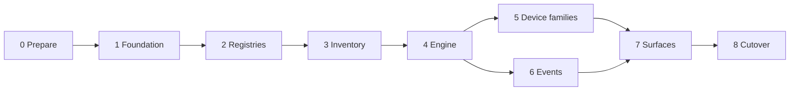

# CyberSathy-NMS Migration Plans

CyberSathy-NMS migrates from the current PHP/RoadRunner NMS on MySQL to a staged architecture: Nginx, Vue 3 + Vite + TypeScript + Pinia, FastAPI, PostgreSQL + TimescaleDB, Redis Streams, Python workers, Prometheus, Grafana, Loki and Alloy. RoadRunner is removed from the final runtime. The PHP backend, YAML model and OID profiles, MIB files and the current Vue frontend are **migration sources** until parity is proven.

Each plan is small, independently testable, has a rollback, and starts only when its dependencies are done. The full picture, principles and current-state numbers are in the [Overview](00-overview.md).

## Start here

| If you want to know | Read |
|---|---|
| What is built and what is broken right now | [STATUS](STATUS.md) |
| The rules for touching devices and proving behavior | [Safety and verification policy](safety-and-verification-policy.md) |
| Decisions waiting for an answer | [Decision log](decisions.md) |
| Whether anything legacy is being forgotten | [Parity inventory](parity-inventory.md) |
| How to run the cutover and undo it | [Cutover runbook](cutover-runbook.md) |
| How to rotate the encryption key | [Key-rotation runbook](key-rotation-runbook.md) |
| What can go wrong | [Risk register](risk-register.md) |

## Reference documents

| Document | Purpose |
|---|---|
| [permission-mapping](permission-mapping.md) | 99 legacy route-permission entries → new permission codes (generated) |
| [api-compatibility](api-compatibility.md) | Legacy routes → new routes, contract differences, external consumers |
| [env-parameter-mapping](env-parameter-mapping.md) | All 119 `.env` parameters → their new home |
| [data-model](data-model.md) | Target schema catalogue, hypertables, retention, legacy table mapping |
| [own-components](own-components.md) | The components we build ourselves (no legacy code, images or names), naming conventions |

## Phases

Each phase changes **one** of: the runtime, the database, or the polling. Never two at once.

| Phase | Purpose | Plans | Exit condition |
|---|---|---|---|
| **0 Prepare** | Clean repo, rotate secrets, settle decisions | [35](35-repo-hygiene-and-secrets.md), [decisions](decisions.md), [parity](parity-inventory.md), [policy](safety-and-verification-policy.md) | No secrets in git; open decisions D-08, D-11, D-12, D-17, D-18 have owners |
| **1 Foundation** | Runtime, schema, auth, roles, minimal CI | [1](01-project-foundation.md), [2](02-postgresql-base-schema.md), [3](03-authentication.md), [36](36-credentials-2fa-service-tokens.md), [4](04-roles-permissions-reseller-scope.md), [33](33-testing-ci.md) (start) | Defects F-01 to F-16 closed; scope leak matrix green |
| **2 Registries** | Vendors, OIDs, MIBs, models | [5](05-vendor-registry.md), [6](06-oid-profile-registry.md), [7](07-mib-library.md), [8](08-device-models.md) | All YAML imports; validators enforce bounds |
| **3 Inventory** | Devices, interfaces, frontend plumbing | [9](09-device-crud.md), [10](10-interface-inventory.md), [24](24-frontend-api-layer.md), [25](25-pinia-migration.md) | Frontend logs in and lists devices against the new API |
| **4 Engine** | Polling, workers, scheduler, operations baseline | [11](11-polling-engine.md), [12](12-worker-services.md), [37](37-scheduler-and-jobs.md), [40](40-operations-backup-retention-tls.md) | Fake-transport tests green; restore drill passes |
| **5 Device families** | Vendor support | [13](13-bdcom-switch-support.md), [14](14-bdcom-olt-support.md), [15](15-huawei-olt-support.md), [16](16-zte-olt-support.md), [17](17-cdata-vsol-gcom-olt-support.md), [18](18-switch-vendor-support.md), [19](19-router-support.md) | Fixtures parse for every family in use |
| **6 Events and realtime** | Alarms, traps, WebSocket, notifications | [20](20-events-alarms.md), [21](21-snmp-trap-service.md), [22](22-realtime-websocket.md), [29](29-notifications.md) | Legacy alarm rules ported with tests |
| **7 Product surfaces** | Dashboards, actions, topology, maps, reports, monitoring, integrations, compatibility | [23](23-dashboard-structure.md), [26](26-dangerous-action-safety.md), [38](38-device-actions-and-console.md), [27](27-topology-links.md), [28](28-maps.md), [30](30-reports.md), [31](31-monitoring-integration.md), [39](39-external-integrations.md), [41](41-legacy-api-compatibility.md) | Parity inventory has no `Open` row |
| **8 Migrate and cut over** | Data, CI complete, cutover | [32](32-data-migration.md), [33](33-testing-ci.md) (complete), [34](34-cutover.md), [40](40-operations-backup-retention-tls.md) (final) | Gate A holds 7 days; stability window passed |

## Plan index

Status legend: `Not started`, `Partial`, `Done`. Live status is kept in [STATUS](STATUS.md).

| Plan | Title | Phase | Depends on | Status |
|---|---|---|---|---|
| 00 | [Overview](00-overview.md) | 0 | none | Done |
| 01 | [Project Foundation](01-project-foundation.md) | 1 | 35 | Done |
| 02 | [PostgreSQL Base Schema](02-postgresql-base-schema.md) | 1 | 1 | Done |
| 03 | [Authentication](03-authentication.md) | 1 | 2 | Done |
| 04 | [Roles, Permissions, Reseller Scope](04-roles-permissions-reseller-scope.md) | 1 | 2, 3 | Partial |
| 05 | [Vendor Registry](05-vendor-registry.md) | 2 | 2 | Done |
| 06 | [OID Profile Registry](06-oid-profile-registry.md) | 2 | 5 | Partial |
| 07 | [MIB Library](07-mib-library.md) | 2 | 6 | Partial |
| 08 | [Device Models](08-device-models.md) | 2 | 5, 6 | Partial |
| 09 | [Device CRUD](09-device-crud.md) | 3 | 4, 8 | Partial |
| 10 | [Interface Inventory](10-interface-inventory.md) | 3 | 9 | Partial |
| 11 | [Polling Engine](11-polling-engine.md) | 4 | 6, 8, 9 | Partial |
| 12 | [Worker Services](12-worker-services.md) | 4 | 1, 11 | Partial |
| 13 | [BDCOM Switch Support](13-bdcom-switch-support.md) | 5 | 11, 12, 6, 8 | Not started |
| 14 | [BDCOM OLT Support](14-bdcom-olt-support.md) | 5 | 11, 12 | Not started |
| 15 | [Huawei OLT Support](15-huawei-olt-support.md) | 5 | 14 | Not started |
| 16 | [ZTE OLT Support](16-zte-olt-support.md) | 5 | 14 | Not started |
| 17 | [C-Data, VSOL, GCOM OLT Support](17-cdata-vsol-gcom-olt-support.md) | 5 | 14 | Not started |
| 18 | [Switch Vendor Support](18-switch-vendor-support.md) | 5 | 13 | Not started |
| 19 | [Router Support](19-router-support.md) | 5 | 11, 12 | Not started |
| 20 | [Events and Alarms](20-events-alarms.md) | 6 | 10, 12 | Partial |
| 21 | [SNMP Trap Service](21-snmp-trap-service.md) | 6 | 12, 20 | Partial |
| 22 | [Realtime WebSocket](22-realtime-websocket.md) | 6 | 4, 12 | Done |
| 23 | [Dashboard Structure](23-dashboard-structure.md) | 7 | 4, 10, 20 | Not started |
| 24 | [Frontend API Layer](24-frontend-api-layer.md) | 3 (grows) | 3 | Not started |
| 25 | [Pinia Migration](25-pinia-migration.md) | 3 (grows) | 24, 3 | Not started |
| 26 | [Dangerous Action Safety](26-dangerous-action-safety.md) | 7 | 4, 36 | Not started |
| 27 | [Topology and Links](27-topology-links.md) | 7 | 10 | Not started |
| 28 | [Maps](28-maps.md) | 7 | 4, 10 | Not started |
| 29 | [Notifications](29-notifications.md) | 6 | 20 | Partial |
| 30 | [Reports](30-reports.md) | 7 | 10, 20 | Not started |
| 31 | [Monitoring Integration](31-monitoring-integration.md) | 7 | 12 | Not started |
| 32 | [Data Migration](32-data-migration.md) | 8 | 2, 4, 9, 10 | Not started |
| 33 | [Testing and CI](33-testing-ci.md) | 1 and 8 | 1 | Partial |
| 34 | [Cutover](34-cutover.md) | 8 | all | Not started |
| 35 | [Repository Hygiene and Secrets](35-repo-hygiene-and-secrets.md) | 0 | none | Not started |
| 36 | [Credentials, 2FA, Service Tokens](36-credentials-2fa-service-tokens.md) | 1 | 2, 3 | Partial |
| 37 | [Scheduler and Jobs](37-scheduler-and-jobs.md) | 4 | 2, 12 | Partial |
| 38 | [Device Actions and Console](38-device-actions-and-console.md) | 7 | 26, 11, 12, 36 | Not started |
| 39 | [External Integrations](39-external-integrations.md) | 7 | 4, 9, 36 | Not started |
| 40 | [Operations, Backup, Retention, TLS](40-operations-backup-retention-tls.md) | 4 and 8 | 1, 2 | Partial |
| 41 | [Legacy API Compatibility](41-legacy-api-compatibility.md) | 7 | 3, 9, 10, 36 | Not started |

Plan numbers are stable identifiers, not the order of work. The order is the phase table above.

## Plan format

Every plan has: **Goal, Current Source / Reference, Target Design, Implementation Steps, Database/API Impact, Frontend Impact, Security / Access Rules, Acceptance Checks, Risks, Definition of Done, Rollback**, and, where a check cannot be confirmed offline, **Hardware sign-off**. The line under the title gives phase, dependencies, status, and any defects the plan owns.

## Global rules

- Backend scope enforcement is mandatory; frontend filtering is only UX.
- ISP/Admin users can access all devices, OLT events, switch/router events, logs, topology and alarms.
- ISP/NOC default focus is switches, routers, links, interfaces, monitoring and events.
- Resellers can have full control only inside assigned scope.
- BDCOM switch and BDCOM OLT profiles stay separate.
- No full SNMP table walks run during device add.
- Writable and action OIDs are never part of polling profiles.
- MIBs are used for documentation and validation, not direct runtime polling.
- **No live device access during development, review or CI.** See the [policy](safety-and-verification-policy.md).
- Credentials are encrypted at rest, write-only, and never appear in logs, audit payloads, fixtures or documents.

## How to keep these documents true

1. Change a plan's status only when its Definition of Done is met, and update [STATUS](STATUS.md) in the same change.
2. A new decision goes in [decisions](decisions.md). A changed decision updates every plan listed under **Affects**.
3. A new legacy behavior discovered goes into [parity-inventory](parity-inventory.md) before anything else.
4. The generated tables ([permission-mapping](permission-mapping.md), [api-compatibility](api-compatibility.md)) are regenerated from `rules.yml` and `config.php`, not edited by hand.
